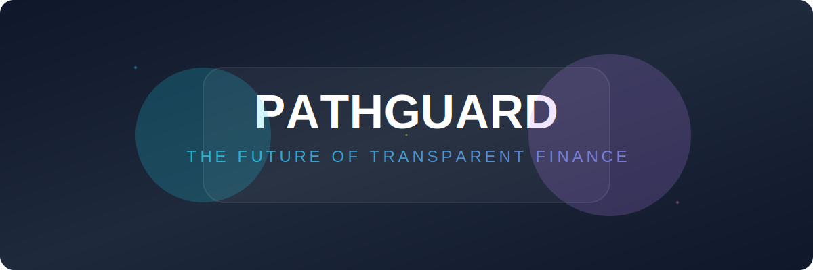
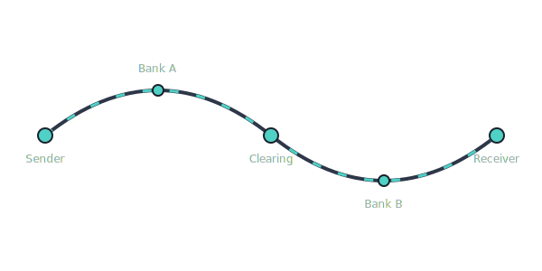
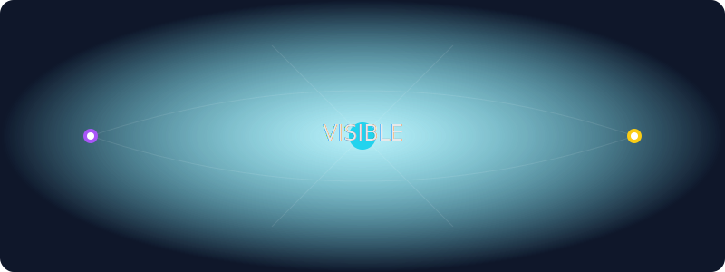
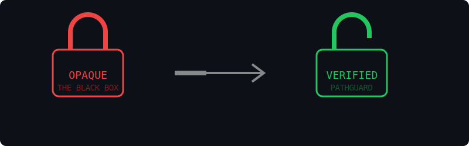
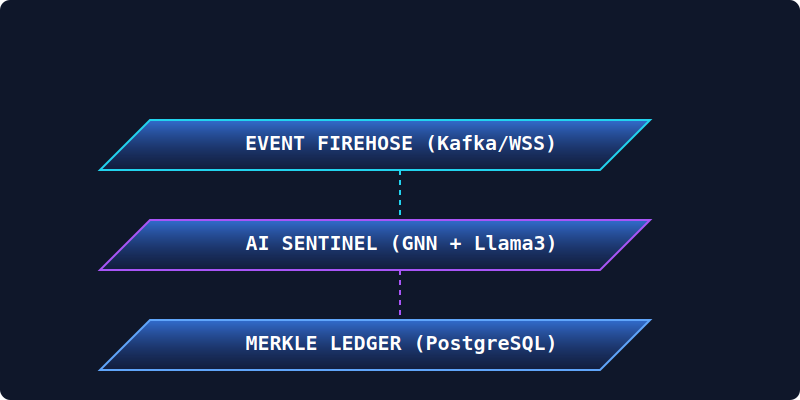
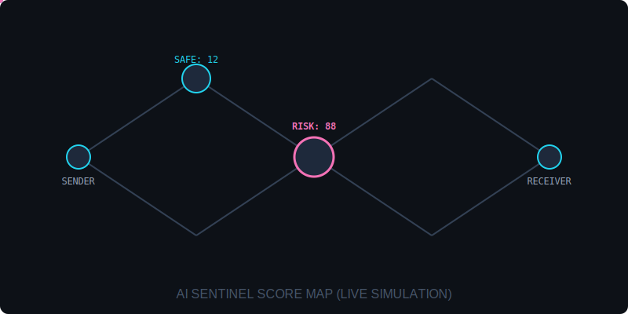
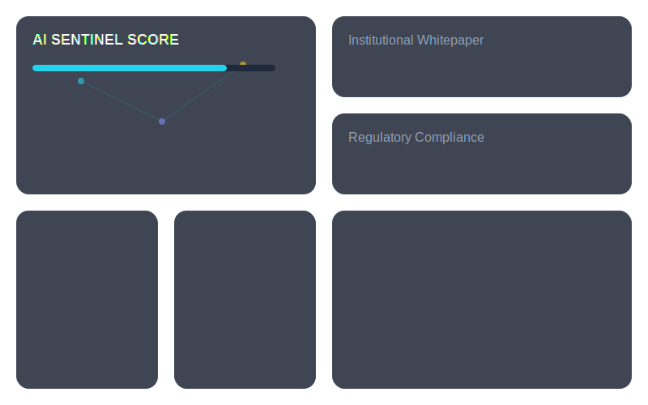

  
  
  
  
  

<h2>The Flow of Trust</h2>

 
 

<!-- VISION SECTION -->

  

<h2>🌟 Vision & Mission</h2>
<table width="100%" style="background: transparent;">
  <tr>
    <td width="50%" valign="top">
      <h3 style="color: #22d3ee;">🎯 Vision</h3>
      
To create a global financial infrastructure where <b>trust is visible, not blind</b>. Every dollar, euro, or yen should have a verifiable passport that shows exactly where it travels, who handles it, and whether it is safe.

    </td>
    <td width="50%" valign="top">
      <h3 style="color: #a855f7;">📜 Mission</h3>
      
PathGuard empowers users, banks, and regulators with <b>real-time transparency</b> into digital money paths. We combine <b>cryptographic verification</b>, <b>AI-driven risk analysis</b>, and <b>immutable audit logs</b> to eliminate the "black box" of modern finance.

    </td>
  </tr>
</table>

  
<b>Click to view Core Values</b>

  <ul>
    <li><b>Transparency:</b> No hidden hops. No opaque gateways.</li>
    <li><b>Security:</b> Bank-grade encryption by default.</li>
    <li><b>Privacy:</b> Zero-Knowledge verification where possible.</li>
    <li><b>Inclusion:</b> Accessible to non-technical users via plain-language AI.</li>
    <li><b>Resilience:</b> Adaptive to real-world incidents (fraud, outages, disasters).</li>
  </ul>

<!-- PROBLEM / SOLUTION SECTION -->

  

<h2>⚖️ The Problem vs. The Solution</h2>
<table width="100%" style="background: transparent;">
  <tr>
    <td width="50%" valign="top" style="border-right: 1px solid #334155; padding-right: 15px;">
      <h3 style="color: #ef4444;">🌑 The Problem: The Black Box</h3>
      
When Person A sends money to Person B, the money travels through a complex backend path:

      <code>Sender → Bank A → Gateway → Clearinghouse → Bank B → Receiver</code>
      
<b>The Risks:</b> Opacity, Uncertainty, Fraud Exploitation, Trust Deficit.

    </td>
    <td width="50%" valign="top" style="padding-left: 15px;">
      <h3 style="color: #22c55e;">💡 The Solution: PathGuard Ecosystem</h3>
      
PathGuard inserts a <b>Verification Layer</b> between the user and the payment rail.

      <ul>
        <li><b>Visible Path:</b> Watch money move like tracking a package.</li>
        <li><b>Cryptographic Proof:</b> Immutable ledger (Merkle Tree).</li>
        <li><b>AI Security Agent:</b> Real-time autonomous fraud monitoring.</li>
        <li><b>Plain Language:</b> Complex data mapped to "Safe/Review/Blocked".</li>
      </ul>
    </td>
  </tr>
</table>

<!-- ARCHITECTURE SECTION -->

  

<h2>🏗️ System Architecture & Features</h2>

PathGuard utilizes a tiered architecture designed for institutional scale and uncompromising security.

<table width="100%">
  <tr style="background: #1e293b; color: #f8fafc;">
    <th>Feature Domain</th>
    <th>Technology Implementation</th>
    <th>Core Benefit</th>
  </tr>
  <tr>
    <td><b>Real-Time Risk Analysis</b></td>
    <td><a href="readme/architecture.md">Graph Neural Networks (GNN)</a></td>
    <td>Instant detection of smurfing & layering.</td>
  </tr>
  <tr>
    <td><b>Transaction Ingestion</b></td>
    <td>Apache Kafka & WebSockets</td>
    <td>High-throughput streaming.</td>
  </tr>
  <tr>
    <td><b>Immutable Auditing</b></td>
    <td>SHA-256 Merkle Chaining</td>
    <td>Privacy-preserving compliance logging.</td>
  </tr>
  <tr>
    <td><b>User Intelligence</b></td>
    <td>Llama3 via Ollama API</td>
    <td>Plain English explanations of complex data.</td>
  </tr>
</table>

<!-- RISK GRAPH SIMULATION -->

  

<h2>📊 Live Risk Simulation Engine</h2>

PathGuard's <b>GNN Notary</b> analyzes the relationship between nodes in real-time, assigning weighted risk scores based on velocity, historical behavior, and path integrity. This simulation shows the sentinel flagging a high-risk hop (88) for human review.

<!-- RESOURCES BENTO GRID -->

  
    
  <h2 style="color: #22d3ee;">📚 Explore the Sentinel Hub</h2>

<table width="100%" style="text-align: center;">
  <tr>
    <td width="20%"></td>
    <td width="20%"></td>
    <td width="20%"></td>
    <td width="20%"></td>
    <td width="20%"></td>
  </tr>
  <tr>
    <td width="20%"></td>
    <td width="20%"></td>
    <td width="20%"></td>
    <td width="20%"></td>
    <td width="20%"></td>
  </tr>
  <tr>
    <td width="20%"></td>
    <td width="20%"></td>
    <td width="20%"></td>
    <td width="20%"></td>
  </tr>
</table>

  Developed with ❤️ by the PathGuard Team  
  <b>Making finance transparent, one hop at a time.</b>

